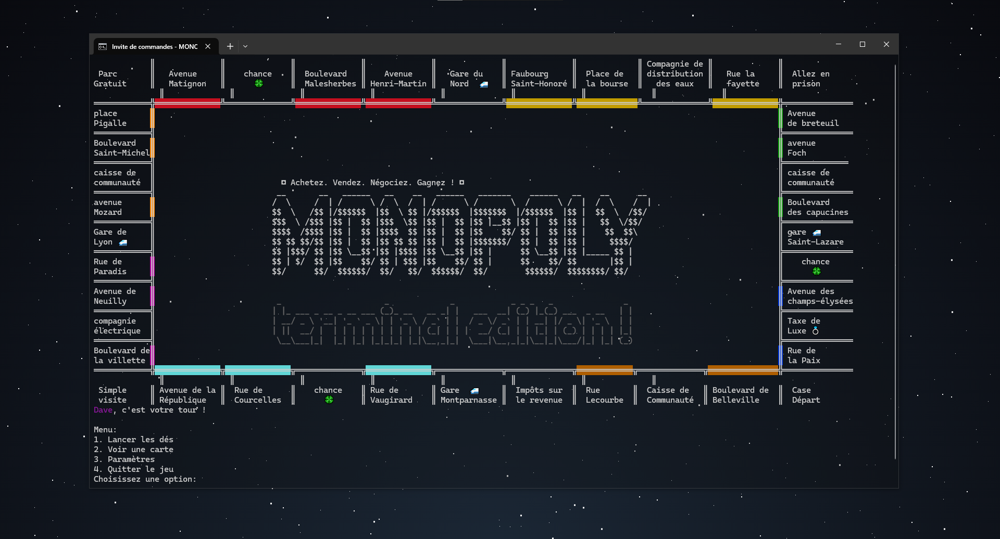

# Monopoly in C

This is a simple implementation of the Monopoly game in C language.
```c
//      __  __  ___  _   _  ___  ____   ___  _  __   __                                            
//     |  \/  |/ _ \| \ | |/ _ \|  _ \ / _ \| | \ \ / /                                            
//     | |\/| | | | |  \| | | | | |_) | | | | |  \ V /                                             
//     | |  | | |_| | |\  | |_| |  __/| |_| | |___| |                                              
//     |_|  |_|\___/|_| \_|\___/|_|    \___/|_____|_|  

//    ████████╗███████╗██████╗ ███╗   ███╗██╗███╗   ██╗ █████╗ ██╗         ███████╗██████╗ ██╗████████╗██╗ ██████╗ ███╗   ██╗    ██╗
//    ╚══██╔══╝██╔════╝██╔══██╗████╗ ████║██║████╗  ██║██╔══██╗██║         ██╔════╝██╔══██╗██║╚══██╔══╝██║██╔═══██╗████╗  ██║    ██║
//       ██║   █████╗  ██████╔╝██╔████╔██║██║██╔██╗ ██║███████║██║         █████╗  ██║  ██║██║   ██║   ██║██║   ██║██╔██╗ ██║    ██║
//       ██║   ██╔══╝  ██╔══██╗██║╚██╔╝██║██║██║╚██╗██║██╔══██║██║         ██╔══╝  ██║  ██║██║   ██║   ██║██║   ██║██║╚██╗██║    ╚═╝
//       ██║   ███████╗██║  ██║██║ ╚═╝ ██║██║██║ ╚████║██║  ██║███████╗    ███████╗██████╔╝██║   ██║   ██║╚██████╔╝██║ ╚████║    ██╗     
```

The game is played on the command line, and the game state is stored in a structure.

The game is composed of the following parts:




* `main.c`: The main function of the game, which initializes the game and starts the game loop.
* `utils.c`: A collection of utility functions used throughout the game.
* `monopoly.h`: The header file which contains the game structure and function prototypes.

The game loop is as follows:

1. The player rolls two dices to determine how many steps they can move.
2. The player moves the corresponding number of steps on the board.
3. The player lands on a square and the game checks if the square has a special action.
4. If the square has a special action, the game performs the action.
5. The game checks if the player has won or lost.
6. If the player has won or lost, the game ends. Otherwise, the game loop continues.

The game has the following special actions:

* When the player lands on a square with a property, they can buy the property.
* When the player lands on a square with a chance card, they draw the top card from the chance deck and follow the instructions on the card.
* When the player lands on a square with a community chest card, they draw the top card from the community chest deck and follow the instructions on the card.
* When the player lands on a square with a tax, they must pay the bank the amount of money indicated on the square.
* When the player lands on a square with a fine, they must pay the bank the amount of money indicated on the square.
* When the player lands on a square with a bonus, they receive the amount of money indicated on the square.
* When the player lands on a square with a free parking, they receive all the money that has been put in the free parking pot.
* When the player lands on a square with a go to jail, they must move directly to the jail square.
* When the player lands on a square with a go square, they receive the amount of money indicated on the square.

The game has the following properties:

* Baltic Avenue
* Mediterranean Avenue
* Oriental Avenue
* Vermont Avenue
* Connecticut Avenue
* States Avenue
* Virginia Avenue
* St. Charles Place
* States Avenue
* Virginia Avenue
* St. James Place
* Tennessee Avenue
* New York Avenue
* Kentucky Avenue
* Indiana Avenue
* Illinois Avenue
* Atlantic Avenue
* Ventnor Avenue
* Marvin Gardens
* Pacific Avenue
* North Carolina Avenue
* Pennsylvania Avenue
* Park Place
* Boardwalk

The game has the following chance cards:

* "Bank error in your favor, collect $200."
* "Doctor's fees, pay $50."
* "Get out of jail free. This card may be kept until needed."
* "Go back three spaces."
* "Go directly to jail."
* "Income tax refund, collect $20."
* "It is your birthday, collect $10 from each player."
* "Life insurance matures, collect $100."
* "Pay school tax of $150."
* "Sell stock, get $45."
* "Super tax, pay $150."
* "You have won first prize in a beauty contest, collect $10."
* "You inherit $100."

The game has the following community chest cards:

* "Bank loan, collect $150."
* "From sale of stock, get $45."
* "Get out of jail free. This card may be kept until needed."
* "Go back three spaces."
* "Go to jail."
* "Income tax refund, collect $20."
* "It is your birthday, collect $10 from each player."
* "Life insurance matures, collect $100."
* "Pay school tax of $150."
* "You have won first prize in a beauty contest, collect $10."
* "You inherit $100."

The game has the following bonuses:

* "Collect $200."
* "Collect $150."
* "Collect $100."
* "Collect $50."
* "Collect $20."
* "Collect $10."

The game has the following fines:

* "Pay $200."
* "Pay $150."
* "Pay $100."
* "Pay $50."
* "Pay $20."
* "Pay $10."

The game has the following free parking:

* "Collect all the money that has been put in the free parking pot."

The game has the following go to jail:

* "Move directly to the jail square."

The game has the following go square:

* "Collect $200."
