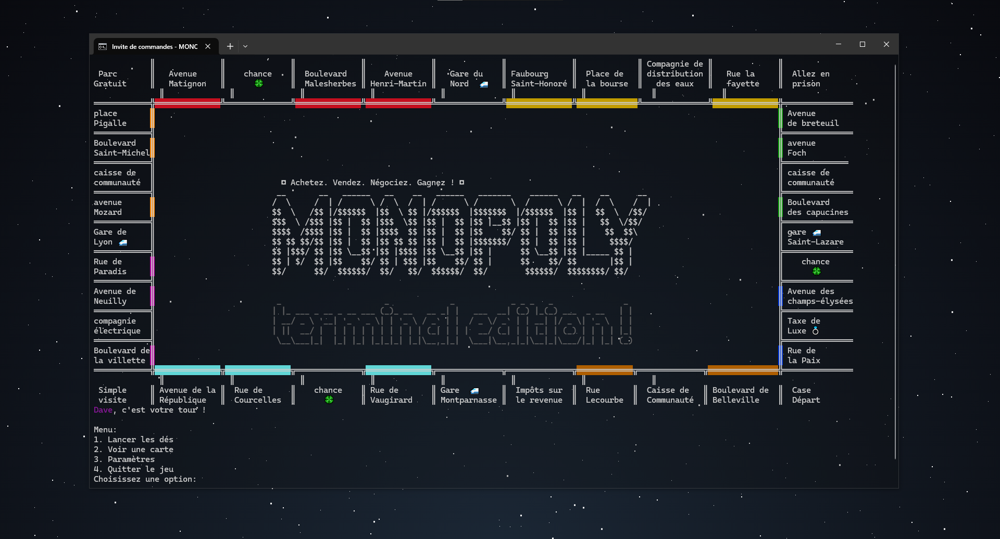

<p align="center">
  <picture>
    <source media="(prefers-color-scheme: dark)" srcset="src/plateau-dark.svg">
    
  </picture>
</p>

# Monopoly in C

This is a simple implementation of the Monopoly game in C language, played in the terminal with the French board (Rue de la Paix, Avenue Foch, Gare de Lyon...).
```c
//      __  __  ___  _   _  ___  ____   ___  _  __   __                                            
//     |  \/  |/ _ \| \ | |/ _ \|  _ \ / _ \| | \ \ / /                                            
//     | |\/| | | | |  \| | | | | |_) | | | | |  \ V /                                             
//     | |  | | |_| | |\  | |_| |  __/| |_| | |___| |                                              
//     |_|  |_|\___/|_| \_|\___/|_|    \___/|_____|_|  

//    ████████╗███████╗██████╗ ███╗   ███╗██╗███╗   ██╗ █████╗ ██╗         ███████╗██████╗ ██╗████████╗██╗ ██████╗ ███╗   ██╗    ██╗
//    ╚══██╔══╝██╔════╝██╔══██╗████╗ ████║██║████╗  ██║██╔══██╗██║         ██╔════╝██╔══██╗██║╚══██╔══╝██║██╔═══██╗████╗  ██║    ██║
//       ██║   █████╗  ██████╔╝██╔████╔██║██║██╔██╗ ██║███████║██║         █████╗  ██║  ██║██║   ██║   ██║██║   ██║██╔██╗ ██║    ██║
//       ██║   ██╔══╝  ██╔══██╗██║╚██╔╝██║██║██║╚██╗██║██╔══██║██║         ██╔══╝  ██║  ██║██║   ██║   ██║██║   ██║██║╚██╗██║    ╚═╝
//       ██║   ███████╗██║  ██║██║ ╚═╝ ██║██║██║ ╚████║██║  ██║███████╗    ███████╗██████╔╝██║   ██║   ██║╚██████╔╝██║ ╚████║    ██╗     
```



## Compile and play

On Mac or Linux:

```bash
make
./monopoly
```

Without `make`: `gcc -Wall -Wextra main.c utils.c display.c -o monopoly`.

On Windows, run `MONOPOLY.exe`, or compile with MinGW: `gcc main.c utils.c display.c -o MONOPOLY.exe`.

The board is wide (about 190 characters): enlarge the terminal window before you play.

## The files

* `main.c`: creates the players, then the game loop (the menu, the dice, what happens on each case).
* `utils.c`: the board (names, prices, rents), the dice, reading a number, the display of the board.
* `display.c`: the cards of the properties and the rules.
* `monopoly.h`: the structures of a case and of a player, and the function prototypes.

## How a turn works

Each player starts with 1500$ on the case "Depart". On his turn, the player chooses in the menu:

1. **Roll the dice**: the player moves forward, and the game checks the case he lands on. With a double, he plays again.
2. **View cards/colors**: the card of a case, or all the cards of a color.
3. **Settings**: change the money of a player.
4. **Rules**: the full rules of Monopoly.
5. **Quit the game**.
6. **Build a house**: on a property, when the player owns the whole color (5 houses = a hotel).

Only rolling the dice ends the turn: you can look at the cards or build before.

## What happens on each case

* **A property, a station or a company nobody owns**: the player can buy it.
* **A case owned by another player**: the player pays the rent to the owner.
  * Property: the rent depends on the number of houses, and is doubled without houses when the owner has the whole color.
  * Station: 25$, 50$, 100$ or 200$ depending on the number of stations of the owner.
  * Company: 4 times the dice, or 10 times with both companies.
* **Passing by "Depart"**: the player receives 200$.
* **Impots sur le revenue**: pay 200$. **Taxe de Luxe**: pay 100$.
* **Chance or Caisse de Communaute**: the player draws a card (see below).
* **Allez en prison**: the player goes to jail. To get out, he must roll a double; on his third turn in jail he pays 50$ and gets out.
* **Parc Gratuit** and **Simple visite**: nothing happens.

A player with less than 0$ has lost: his properties go back to the bank. The last player still in the game wins.

## The cards

The Chance and Caisse de Communaute cards are drawn at random:

* "La banque vous verse un dividende de 50$."
* "Payez la note du medecin : 50$."
* "Avancez jusqu'a la case Depart, recevez 200$."
* "Allez en prison !"
* "Vous heritez de 100$."
* "Payez vos frais de scolarite : 150$."

## The properties

| Color | Properties |
| --- | --- |
| Brown | Boulevard de Belleville, Rue Lecourbe |
| Light blue | Rue de Vaugirard, Rue de Courcelles, Avenue de la Republique |
| Pink | Boulevard de la Villette, Avenue de Neuilly, Rue de Paradis |
| Orange | Avenue Mozart, Boulevard Saint-Michel, Place Pigalle |
| Red | Avenue Matignon, Boulevard Malesherbes, Avenue Henri-Martin |
| Yellow | Faubourg Saint-Honore, Place de la Bourse, Rue la Fayette |
| Green | Avenue de Breteuil, Avenue Foch, Boulevard des Capucines |
| Dark blue | Avenue des Champs-Elysees, Rue de la Paix |
| Stations | Gare Montparnasse, Gare de Lyon, Gare du Nord, Gare Saint-Lazare |
| Companies | Compagnie electrique, Compagnie des eaux |

## Not done yet

The ideas for later are in [help.md](help.md): save a game, trades between players, mortgages, auctions...
