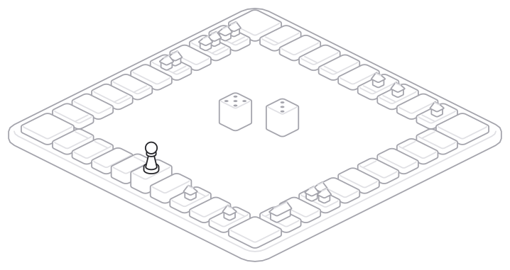
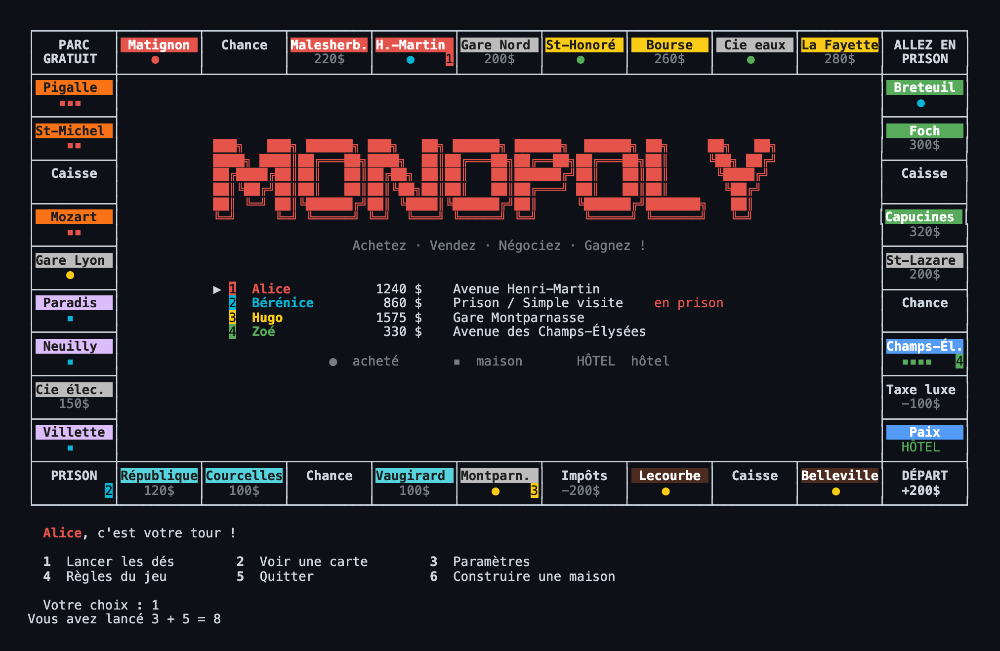
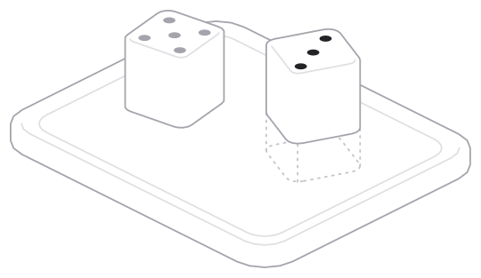
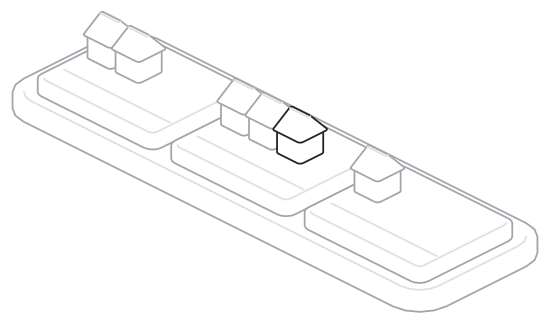
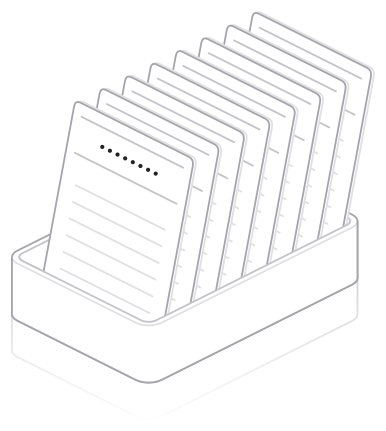
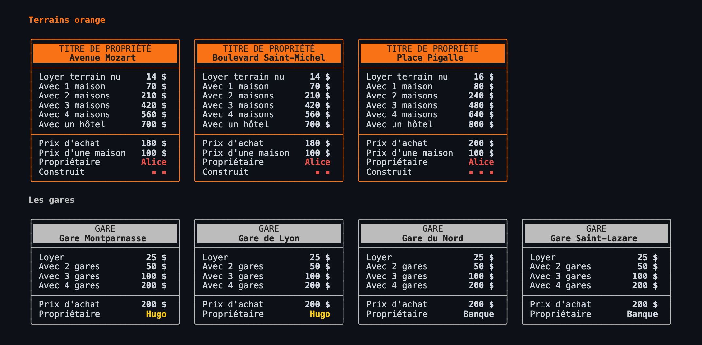

<p align="center">
  <picture>
    <source media="(prefers-color-scheme: dark)" srcset="src/plateau-dark.svg">
    
  </picture>
</p>

<h1 align="center">Monopoly · édition terminal</h1>

<p align="center">
  Le Monopoly français, de la Rue Lecourbe à la Rue de la Paix, écrit en C et joué à plusieurs dans un terminal.
</p>

<p align="center">
  
</p>

## Lancer une partie

Sur Mac ou Linux :

```bash
make
./monopoly
```

Sans `make` : `gcc -Wall -Wextra main.c utils.c display.c -o monopoly`

Sur Windows, lancer `MONOPOLY.exe`, ou compiler avec MinGW : `gcc main.c utils.c display.c -o MONOPOLY.exe`

Le plateau fait 122 colonnes de large : agrandir la fenêtre du terminal avant de jouer.

## Un tour de jeu

<p align="center">
  <picture>
    <source media="(prefers-color-scheme: dark)" srcset="src/des-dark.svg">
    
  </picture>
</p>

De 2 à 8 joueurs. Chacun choisit son nom et sa couleur, et commence avec 1500 $ sur la case Départ. À son tour, le joueur choisit dans le menu :

| | |
| --- | --- |
| **1** Lancer les dés | il avance de la somme des deux dés ; avec un double, il rejoue |
| **2** Voir une carte | le titre de propriété d'une case, ou toutes les cartes d'une couleur |
| **3** Paramètres | changer l'argent d'un joueur |
| **4** Règles du jeu | les règles complètes du Monopoly |
| **5** Quitter | fin de la partie |
| **6** Construire une maison | sur un terrain dont il a toute la couleur |

Seul le lancer de dés termine le tour : on peut regarder les cartes ou construire avant de jouer.

## Ce qui se passe sur chaque case

| Case | Effet |
| --- | --- |
| Terrain, gare ou compagnie libre | le joueur peut l'acheter |
| Terrain d'un autre joueur | il paie le loyer, qui dépend des maisons ; sans maison, le loyer est doublé si le propriétaire a toute la couleur |
| Gare d'un autre joueur | 25 $, 50 $, 100 $ ou 200 $ selon le nombre de gares du propriétaire |
| Compagnie d'un autre joueur | 4 fois les dés, 10 fois si le propriétaire a les deux compagnies |
| Passage par Départ | il reçoit 200 $ |
| Impôts sur le revenu / Taxe de luxe | il paie 200 $ / 100 $ |
| Chance / Caisse de communauté | il tire une carte au hasard |
| Allez en prison | direct en prison : il en sort avec un double, ou en payant 50 $ au troisième tour |
| Parc Gratuit / Simple visite | rien ne se passe |

Un joueur qui passe sous 0 $ a perdu : ses propriétés retournent à la banque. Le dernier joueur encore en jeu gagne la partie.

## Construire

<p align="center">
  <picture>
    <source media="(prefers-color-scheme: dark)" srcset="src/maisons-dark.svg">
    
  </picture>
</p>

Pour construire, il faut posséder **tous les terrains d'une couleur**. Une maison coûte 50 $, 100 $, 150 $ ou 200 $ selon le côté du plateau. Après 4 maisons, la cinquième devient un **hôtel**. Sur le plateau, les maisons s'affichent `▪` dans la couleur du propriétaire, et l'hôtel `HÔTEL`.

## Les cartes

<p align="center">
  <picture>
    <source media="(prefers-color-scheme: dark)" srcset="src/cartes-dark.svg">
    
  </picture>
</p>

Chaque case a son titre de propriété, comme dans le vrai jeu : les loyers, les prix et le propriétaire. Le menu **2** affiche une case seule, ou toutes les cartes d'une couleur côte à côte.

<p align="center">
  
</p>

Les cartes Chance et Caisse de communauté sont tirées au hasard parmi :

* La banque vous verse un dividende de 50 $.
* Payez la note du médecin : 50 $.
* Avancez jusqu'à la case Départ, recevez 200 $.
* Allez en prison !
* Vous héritez de 100 $.
* Payez vos frais de scolarité : 150 $.

## Lire le plateau

* La **bande de couleur** porte le nom du terrain ; les gares et les compagnies ont une bande grise.
* Sous le nom : le **prix** si la case est à vendre, `●` si elle est achetée, `▪` pour chaque maison, `HÔTEL`, le tout dans la couleur du propriétaire.
* Les **chiffres colorés** sont les pions des joueurs.
* Au **centre** : chaque joueur, son argent, sa case, et `▶` devant celui qui joue.

## Les fichiers

| Fichier | Contenu |
| --- | --- |
| `main.c` | la création des joueurs, la boucle de jeu, ce qui se passe sur chaque case |
| `display.c` | le plateau, les titres de propriété et les règles |
| `utils.c` | les cases (noms, prix, loyers), les dés, la lecture d'un nombre, le menu |
| `monopoly.h` | les structures d'une case et d'un joueur, les couleurs et les prototypes |

## Pas encore fait

Les idées pour la suite sont dans [help.md](help.md) : sauvegarder une partie, échanger entre joueurs, hypothèques, enchères…

<sub>Illustrations dessinées avec [Hairline](https://github.com/lucasmarkes/hairline).</sub>
